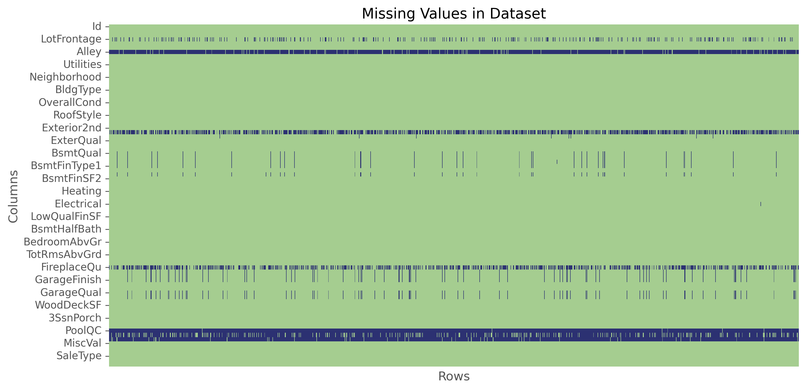
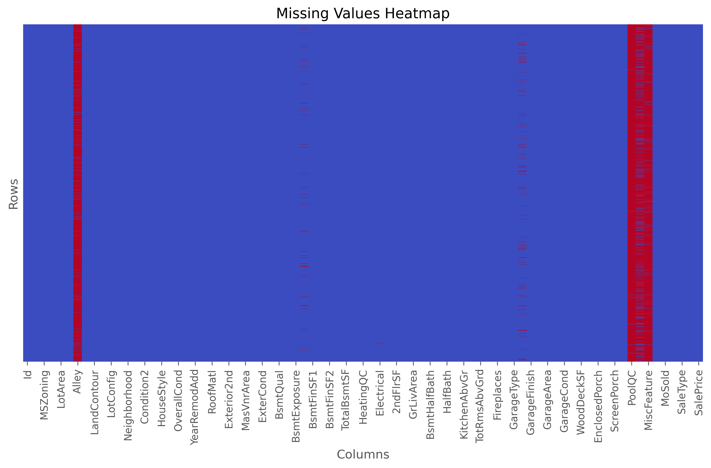
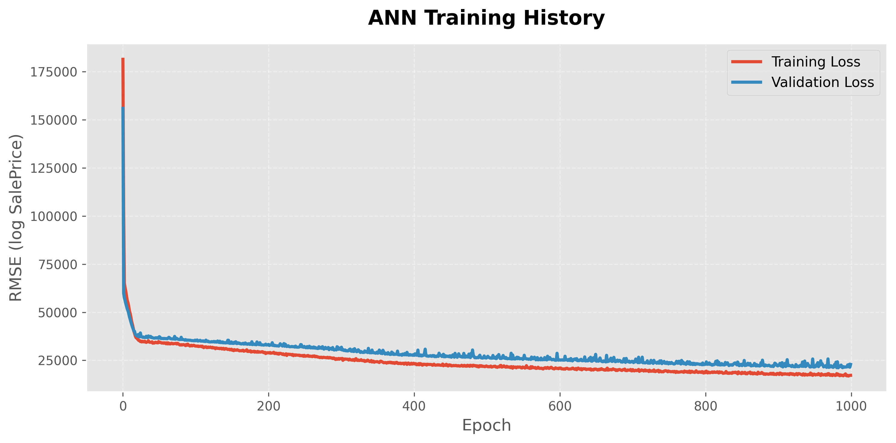

# 🏠 House Prices — Advanced Regression Techniques


An end-to-end machine learning notebook for the [Kaggle House Prices – Advanced Regression Techniques](https://www.kaggle.com/competitions/house-prices-advanced-regression-techniques) competition. The project walks through data loading, exploratory data analysis (EDA), missing-value imputation, feature engineering, categorical encoding, and two modeling approaches—a tuned **XGBoost Regressor** and a **Keras Artificial Neural Network (ANN)**—to predict residential home sale prices.

> ⚠️ **Note:** This is a single-notebook data science project (`code.ipynb`). There is no application code, API, or CLI — everything described below reflects what is actually implemented in the notebook.

---

## ✨ Features

- 📥 Loads the Kaggle `train.csv` / `test.csv` datasets with `pandas`.
- 🔍 Visualizes missing data with two Seaborn heatmaps (by column and by row), saved as PNGs.
- 🛠️ Imputes missing values:
  - Numerical columns (e.g. `LotFrontage`) filled with the **mean**.
  - Categorical columns (e.g. `BsmtCond`, `GarageType`, `FireplaceQu`, `MasVnrType`) filled with the **mode**.
  - Remaining columns across the combined train+test set filled with **mode** (categorical) / **median** (numerical).
- 🧩 One-hot encodes 41 categorical columns via a custom `category_onehot_multcols()` helper (`pd.get_dummies`, first category dropped).
- 🧹 Drops low-value/irrelevant columns: `Id`, `MiscVal`, `MiscFeature`, `Utilities`.
- 🚫 Removes outliers with `GrLivArea > 4000` from the training set.
- 🤖 Trains an **XGBoost Regressor** with hyperparameter search via `RandomizedSearchCV` (50 iterations, 5-fold CV, scored on negative MAE) over `n_estimators`, `max_depth`, `learning_rate`, `min_child_weight`, `subsample`, `colsample_bytree`, and `gamma`.
- 📈 Applies a `log1p` transform to the target (`SalePrice`) before training and `expm1` to invert predictions.
- 💾 Persists the trained XGBoost model to `model/finalized_model.pkl` using `pickle`.
- 🧠 Builds and trains a **Keras Sequential ANN** (50 → 25 → 50 → 1 units, ReLU, `he_uniform` init) with a custom RMSE loss function and the `Adamax` optimizer (1000 epochs, batch size 10, 20% validation split).
- 📝 Logs ANN training/validation loss per epoch to `outputs/training_log.csv` via `CSVLogger`.
- 📉 Plots and saves the ANN training curve to `images/ann_training_curve.png`.
- 📤 Generates a Kaggle-format submission file (predicted `SalePrice` per `Id`).

---

## 🧰 Tech Stack

| Category | Tools / Libraries |
|---|---|
| Language | Python 3 |
| Environment | Jupyter Notebook (`code.ipynb`) |
| Data handling | pandas, NumPy |
| Visualization | Matplotlib, Seaborn |
| Classical ML | scikit-learn (`RandomizedSearchCV`, `StandardScaler`), XGBoost |
| Deep Learning | TensorFlow / Keras (`Sequential`, `Dense`, `CSVLogger`, Keras backend) |
| Serialization | `pickle` |

---

## 📁 Project Structure

```
House Prices - Advanced Regression Techniques/
├── code.ipynb                          # Main (and only) notebook — full pipeline
├── data/
│   ├── train.csv                       # Training data (1460 rows)
│   ├── test.csv                        # Test data (1459 rows)
│   ├── sample_submission.csv           # Kaggle sample submission format
│   └── data_description.txt            # Feature definitions provided by Kaggle
├── images/
│   ├── missing_values_heatmap.png      # Missing values by column
│   ├── missing_values_heatmap_rows.png # Missing values by row
│   └── ann_training_curve.png          # ANN training/validation loss curve
├── model/
│   └── finalized_model.pkl             # Pickled, tuned XGBoost regressor
└── outputs/
    ├── submission.csv                  # Generated Kaggle submission
    └── training_log.csv                # Per-epoch ANN loss log (CSVLogger output)
```

---

## ⚙️ Requirements

The notebook imports the following packages, none of which are pinned to a specific version anywhere in the project:

```
numpy
pandas
matplotlib
seaborn
scikit-learn
xgboost
tensorflow
```

- Python 3.x
- Jupyter Notebook or JupyterLab to run `code.ipynb`

---

## 🚀 Installation

Since no `requirements.txt` or environment file is included, dependencies must be installed manually:

```bash
# 1. Clone the repository
git clone <your-repo-url>
cd "House Prices - Advanced Regression Techniques"

# 2. Create a virtual environment (recommended)
python -m venv venv
source venv/bin/activate      # Windows: venv\Scripts\activate

# 3. Install dependencies
pip install numpy pandas matplotlib seaborn scikit-learn xgboost tensorflow jupyter
```

---

## ▶️ Usage

1. Ensure the `data/` folder contains `train.csv`, `test.csv`, and `sample_submission.csv` (already included in this repo).
2. Launch Jupyter and open the notebook:

   ```bash
   jupyter notebook code.ipynb
   ```

3. Run all cells sequentially, in order:
   - **Load & explore data** — reads `train.csv`, inspects nulls, generates missing-value heatmaps.
   - **Handle missing values** — imputes NaNs column by column.
   - **Handle categorical features** — one-hot encodes the combined train+test set.
   - **Model training (XGBoost)** — runs `RandomizedSearchCV`, fits the best estimator on log-transformed `SalePrice`, and pickles it to `model/finalized_model.pkl`.
   - **Neural network (Keras ANN)** — trains the 4-layer ANN and logs/plots the training curve.

4. Predictions are generated with `regressor.predict(df_Test)` and written to a submission file.

   > ⚠️ **Implementation note:** the notebook's final write step (cell writing predictions) saves output to `data/sample_submission.csv`, **overwriting the original Kaggle sample file** rather than writing to `outputs/submission.csv`. The `outputs/submission.csv` file included in this repo appears to be a separately generated artifact. If reusing this notebook, consider changing the output path to avoid overwriting source data.


## 🖼️ Screenshots

The notebook generates the following visual artifacts during execution:

| Missing Values (by column) | Missing Values (by row) | ANN Training Curve |
|---|---|---|
|  |  |  |

---

## 💡 Example Usage

Loading the trained XGBoost model and generating predictions on new, similarly preprocessed data:

```python
import pickle
import pandas as pd
import numpy as np

# Load the trained model
with open("model/finalized_model.pkl", "rb") as f:
    model = pickle.load(f)

# df_Test must go through the SAME preprocessing pipeline
# (missing-value imputation + one-hot encoding) as in code.ipynb
predictions_log = model.predict(df_Test)
predictions = np.expm1(predictions_log)   # invert the log1p target transform

submission = pd.DataFrame({
    "Id": test_ids,
    "SalePrice": predictions
})
submission.to_csv("outputs/submission.csv", index=False)
```

---

## 🔭 Future Improvements

- Refactor the notebook into modular, reusable Python scripts (e.g. `preprocess.py`, `train.py`, `predict.py`).
- Add a `requirements.txt` or `environment.yml` with pinned dependency versions.
- Fix the submission-writing step to save to `outputs/submission.csv` instead of overwriting `data/sample_submission.csv`.
- Persist the fitted `StandardScaler` and one-hot encoding schema (e.g. with `pickle`/`joblib`) so new data can be transformed consistently at inference time, outside the notebook.
- Save the trained ANN model (e.g. `classifier.save(...)`) and its predictions — currently `ann_pred` is computed but never written to disk.
- Add model evaluation metrics (RMSE, MAE, R²) on a held-out validation set for both XGBoost and the ANN, and compare them explicitly.
- Add cross-validation / ensembling between the XGBoost and ANN outputs.
- Add unit tests and a proper `.gitignore` (to exclude large files like the trained `.pkl` model and raw CSVs).
- Add a `LICENSE` file to clarify usage terms.

---

## 🤝 Contributing

No contribution guidelines are currently defined for this project. If you'd like to contribute:

1. Fork the repository.
2. Create a feature branch (`git checkout -b feature/your-feature`).
3. Commit your changes.
4. Open a pull request describing your changes.

---

## 📌 Suggested Improvements — Project & README

**Project:**
- Convert the notebook's linear, hardcoded workflow into functions/classes with clear inputs and outputs for maintainability and testability.
- Separate the EDA/visualization cells from the modeling pipeline so the pipeline can run headlessly.
- Add logging and reproducibility controls (fixed seeds are already used for XGBoost `random_state`, but the ANN training has no seed set).
- Validate the "combine train+test before imputing/encoding" approach — it works but risks data leakage patterns worth documenting explicitly.
